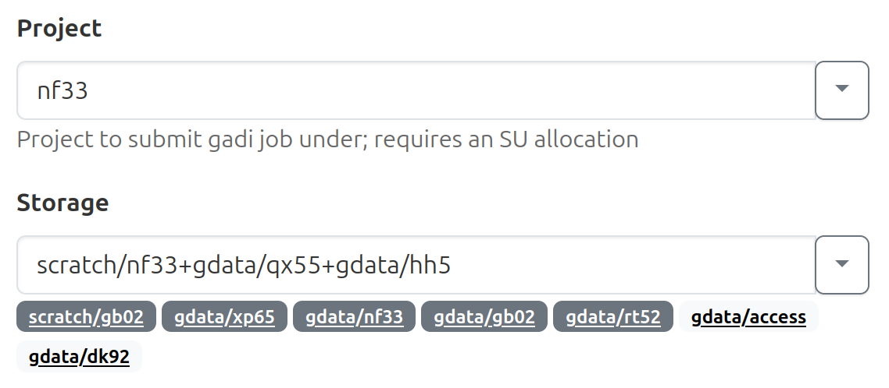
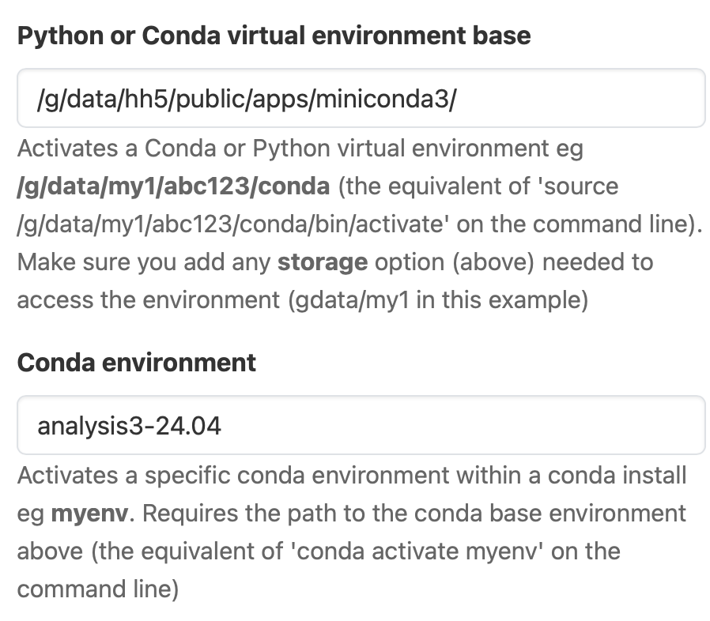
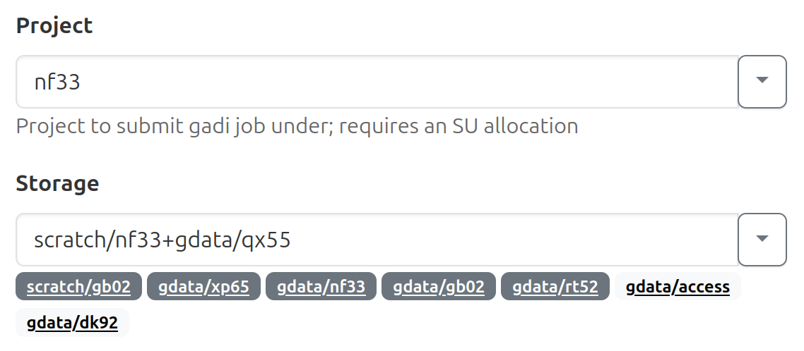
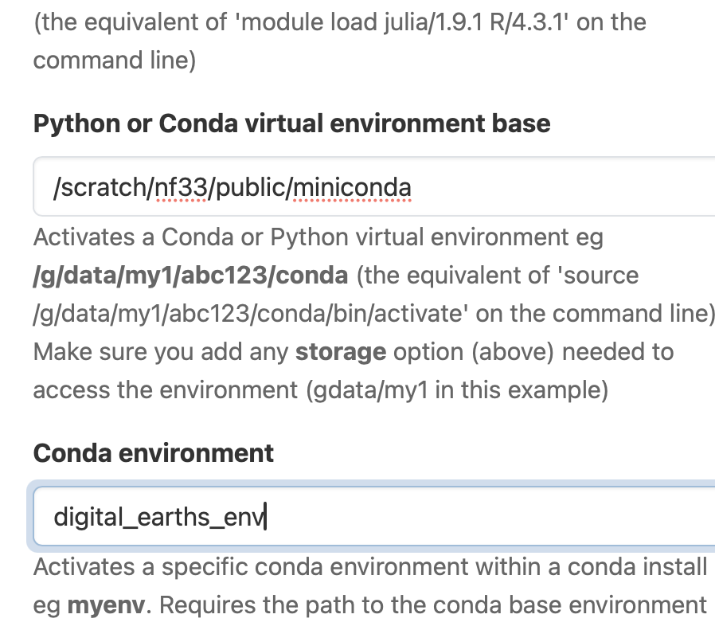

# Kilometre-Scale Global Hackathon 2025

This repository includes the instructions to meet all the technical requirements to work during the Hackathon. It also includes examples on how to work with `healpy` and the helpix grid. 

### 1. Join the neccesary NCI projects

Please log in into [my.nci.org.au](https://my.nci.org.au/mancini/) and join the following projects:

* `nf33` (for computations)
* `qx55` (where the km-scale simulations live. Check [the available simulations here](/available_simulations.md))
* `xp65` (to access the conda environment, see below)
* and any other project you think you will need. For example, join `rt52` if you are going to use ERA5 data.

### 2. Clone this repository 

If you want to run the examples located in `notebooks/` clone this repository in Gadi (to be able to access the **test data**).

```
git clone git@github.com:21centuryweather/hackathon-2025-australia-node.git
```
## 3. Conda environment

> [!WARNING] 
> ARE sessions won't work if you include projects in gdata4 on the storage field (xp65, qx55, gd02, nf33, etc). 
 
### 3.1 For researchers with hh5 membership.

As a temporary work-around from the current the disk failure, you can use the following commands to load a python environment if you are a member of `hh5`.
```
module use /g/data/hh5/public/modules
module load conda/analysis3
source /scratch/nf33/public/hackathon_env/bin/activate
```
To use this environment in an ARE session, link the juypyter kernel to your local directory.
```
mkdir -p ~/.local/share/jupyter/kernels/
cd ~/.local/share/jupyter/kernels/
ln -s /scratch/nf33/public/hackathon_env/share/jupyter/kernels/hackathon_env/
```
Start an ARE session with the following storage parameters.



Use the following **advanced settings:**

* **Python or Conda virtual environment base**

`/g/data/hh5/public/apps/miniconda3/`

* **Conda environment**

`analysis3-24.04`




### 3.2 For researchers without hh5 membership,

To use a copy of the digital earth conda environment installed on gadi, link this new  juypyter kernel to your local directory.

```
mkdir -p ~/.local/share/jupyter/kernels/
cd ~/.local/share/jupyter/kernels/
ln -s /scratch/nf33/public/digital_earths_venv/share/jupyter/kernels/digital_earths_venv
```
Start an ARE session with the following storage parameters.

> [!NOTE] 
> This is slightly different to loading other conda environments into the ARE you may have used previously.



Use the following **advanced settings:**

* **Python or Conda virtual environment base**

`/scratch/nf33/public/miniconda/`

* **Conda environment**

`digital_earths_env`



If you want to use this environment outside of an ARE session (i.e. via direct ssh session from the command line) you may need to install conda locally on gadi.

## Projects 

Here is the list of projects proposed by the Australian node. We encourage you to check them but also visit the [global hackathon website](https://digital-earths-global-hackathon.github.io/hk25/) to find other relevant projects and people working on similar topics. 

* Towards enhancing climate projections through improved understanding and simulations of marine low clouds
* [Evaluation of Meso-scale Degree of Organization of Convection](https://github.com/21centuryweather/hk25-AusNode-DOCmeso)
* [Chasing Cyclones](https://github.com/21centuryweather/hk25-AusCyclones)
* [Model intercomparison for extremes precipitation](https://github.com/21centuryweather/hk25-AusNode-ExtremePrecipitation)
* [Unravelling the representation of Tropical Convergence Zones in km-scale model runs](https://github.com/21centuryweather/hk25-AusNode-TConvZones)
* [The relationship of cloud size and number with large-scale environment for precipitation in high-resolution models](https://github.com/21centuryweather/hk25-AusNode-LargeScaleP)
* [Diurnal cycle of coastal winds and rainfall](https://github.com/21centuryweather/hk25-AusNode-coastal)
* [Precipitation/soil moisture feedback: positive or negative?](https://github.com/21centuryweather/hk25-AusNode-land)
* [The hunt for city-driven atmospheric circulation](https://github.com/21centuryweather/hk25-CityCirc)
* [Convectively-Coupled Systems in the Tropics as Simulated in Global Storm Resolving Models](https://github.com/21centuryweather/hk25-AusNode-ConvTrop)


