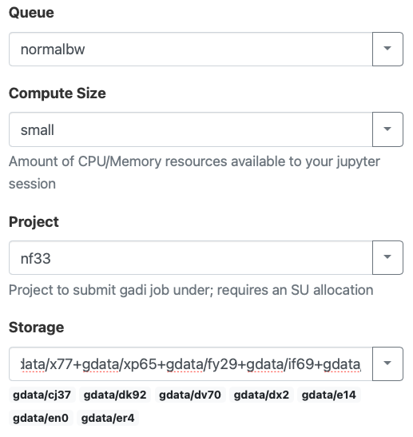
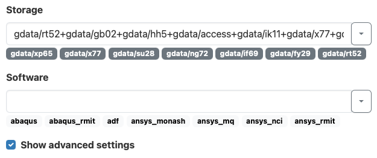
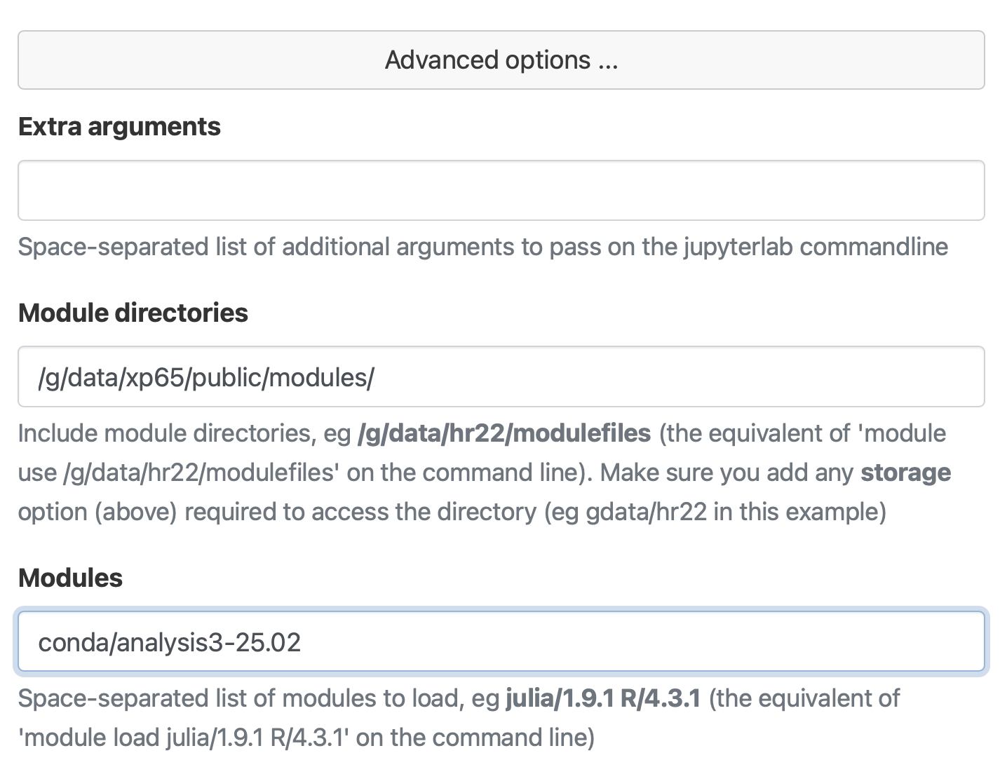
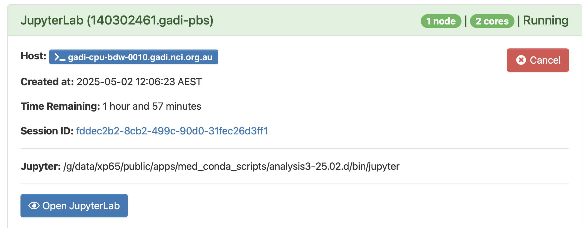
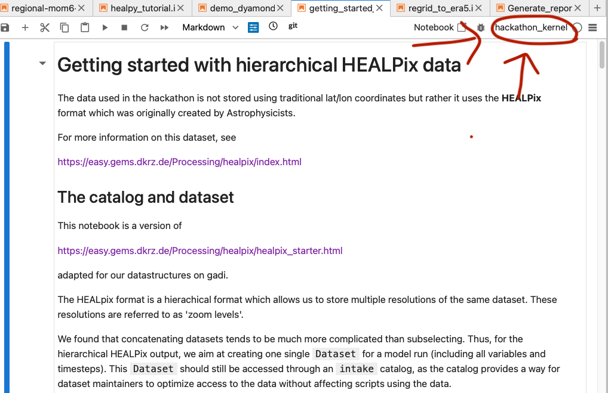
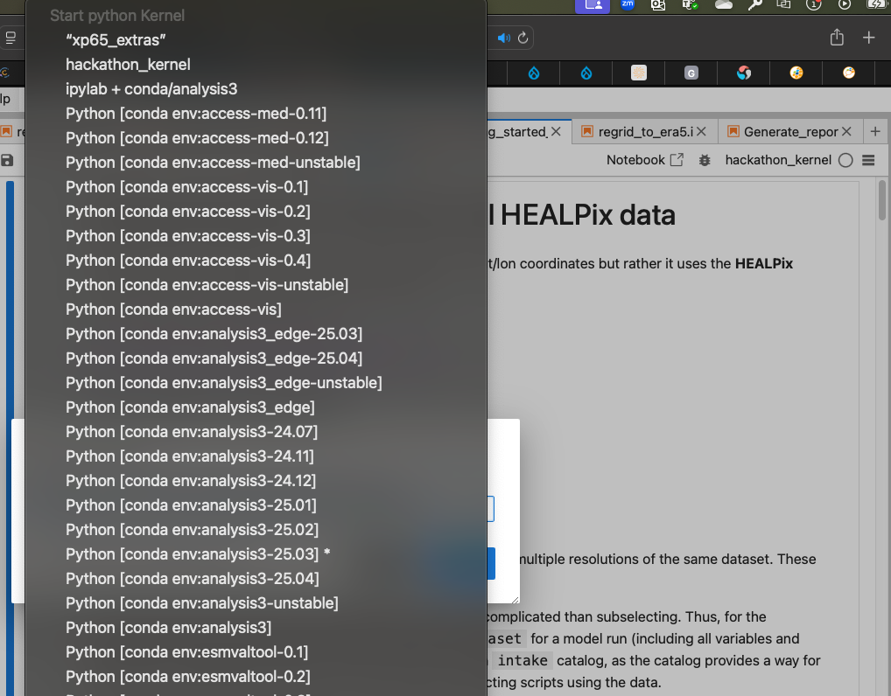

# Kilometre-Scale Global Hackathon 2025

This repository includes the instructions to meet all the technical requirements to work during the Hackathon. It also includes examples on how to work with `healpy` and the helpix grid. 

### 1. Join the necesiry NCI projects

Please log in into [my.nci.org.au](https://my.nci.org.au/mancini/) and join the following projects:

* `nf33` (for computations)
* `qx55` (where the km-scale simulations live. Check [the available simulations here](/available_simulations.md))
* `xp65` (to access the conda environment, see below)
* and any other project you think you will need. For example, join `rt52` if you are going to use ERA5 data.

### 2. Clone this repository 

If you want to run the examples located in `notebooks/` clone this repository in Gadi (to be able to access the **test data**).

```
git clone git@github.com:21centuryweather/hackathon-2025-australia-node.git
```

### 3. Use the correct python environment

To process the hackathon data, we need some extra `python` modules that aren't included in the standard `xp65 analysis3` conda environment. So a python virtual environment has been created to use for the hackathon. To use it, load the `xp65` conda environment as normal, but take care to load a **specific version** of analysis3:

```
module use /g/data/xp65/public/modules
module load conda/analysis3-25.02
```
Now type the following to load the virtual environment.

```
source /g/data/nf33/public/hackathon-2025/venvs/hackathon_env/bin/activate
```
This should modify your `gadi` login prompt to

```
(hackathon_env) [<user-id>@gadi-login-0<username> ]$
```
You can test this virtual environment can load our required modules form the command line using `python` or `ipython`

```python
$ ipython
/g/data/xp65/public/apps/med_conda/envs/analysis3-25.02/lib/python3.11/site-packages/IPython/core/interactiveshell.py:937: UserWarning: Attempting to work in a virtualenv. If you encounter problems, please install IPython inside the virtualenv.
  warn(
Python 3.11.11 | packaged by conda-forge | (main, Dec  5 2024, 14:17:24) [GCC 13.3.0]
Type 'copyright', 'credits' or 'license' for more information
IPython 8.31.0 -- An enhanced Interactive Python. Type '?' for help.

In [1]: import healpy as hp

In [2]: import easygems.healpix as egh

In [3]: 
```
> [!NOTE]
> If you are working inside an ARE VDI Desktop, you need to run `ssh localhost` and your password before running the above commands. This is because VDI runs using a container, and the `xp65` environment also uses a container. You can't run a container from inside another container.

> [!NOTE]
> The `xp65` python environment is run using a `bash` 

> [!WARNING] 
> If you fail to specify 'analysis3-25.02' your python session may exit with a segmentation fault when importing the easygems module.

### 4. Using this python environment inside an ARE JupyterLab session.

To use this virtual environment inside an ARE Jupyter notebook session, you must link the jupyter kernel to a local directory. Type the following commands at a gadi terminal.

```
cd ~/.local/share/jupyter/kernels/
ln -s /g/data/nf33/public/hackathon-2025/venvs/hackathon_env/share/jupyter/kernels/hackathon_env
```

Now we can start up an ARE session. If you are unfamiliar with how to start an ARE JupyterLab, follow [this link](https://access-hive.org.au/getting_started/are/).

Make sure to choose `nf33` as your project for SU allocation. In the storage field, make sure to include:

* `gdata/nf33` (to load the virtual environment)
* `gdata/qx55` (where the km-scale simulations live)
* `gdata/xp65` (to load the python analysis3 interpreter)

in addition to other storage fields you will require for your work (e.g. `gdata/rt52` if you use ERA5 data).



Now click on the **advanced settings** options.



Specify the **Module directories** and **Modules** fields as set out below.

> [!NOTE] 
> This is slightly different to loading other conda environments into the ARE you may have used previously.



When the ARE session has loaded, make sure to check the Jupyter path points to the `xp65` `analysis3-25.0.2d` directory.



Inside the notebook, click on the kernel selection pull down menu in the top right corner.



Of the available options, select **'hackathon_kernal'**



Happy hacking!

## Projects 

Here is the list of projects proposed by the Australian node. We encourage you to check them but also visit the [global hackathon website](https://digital-earths-global-hackathon.github.io/hk25/) to find other relevant projects and people working on similar topics. 

* Towards enhancing climate projections through improved understanding and simulations of marine low clouds
* Evaluation of Meso-scale Degree of Organization of Convection
* Chasing Cyclones
* Model intercomparison for extremes precipitation
* Unravelling the representation of Tropical Convergence Zones in km-scale model runs
* [The relationship of cloud size and number with large-scale environment for precipitation in high-resolution models](https://github.com/21centuryweather/hk25-AusNode-LargeScaleP)
* [Diurnal cycle of coastal winds and rainfall](https://github.com/21centuryweather/hk25-AusNode-coastal)
* [Precipitation/soil moisture feedback: positive or negative?](https://github.com/21centuryweather/hk25-AusNode-land)
* [The hunt for city-driven atmospheric circulation](https://github.com/21centuryweather/hk25-AusCyclones)
* [Convectively-Coupled Systems in the Tropics as Simulated in Global Storm Resolving Models](https://github.com/21centuryweather/hk25-AusNode-ConvTrop)
